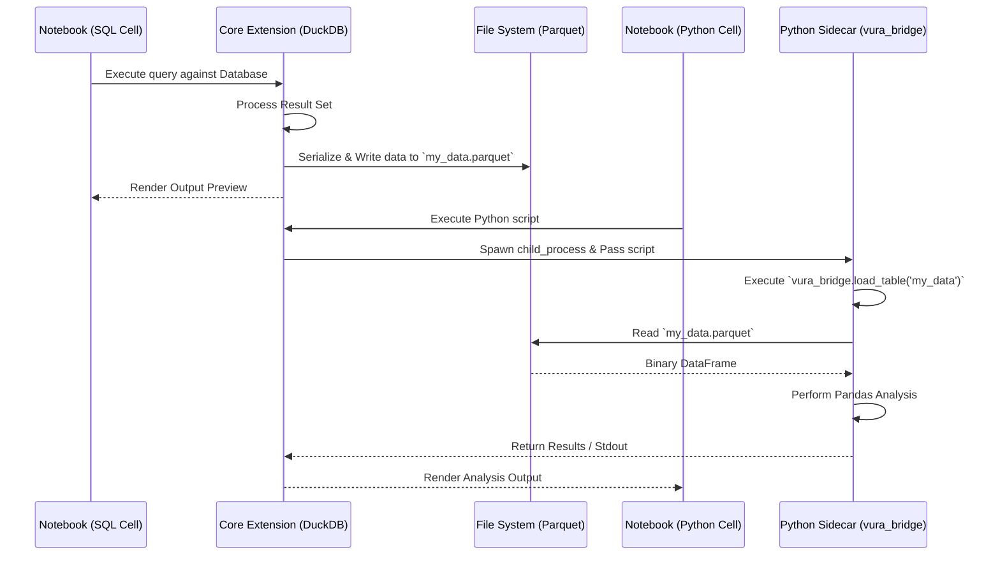
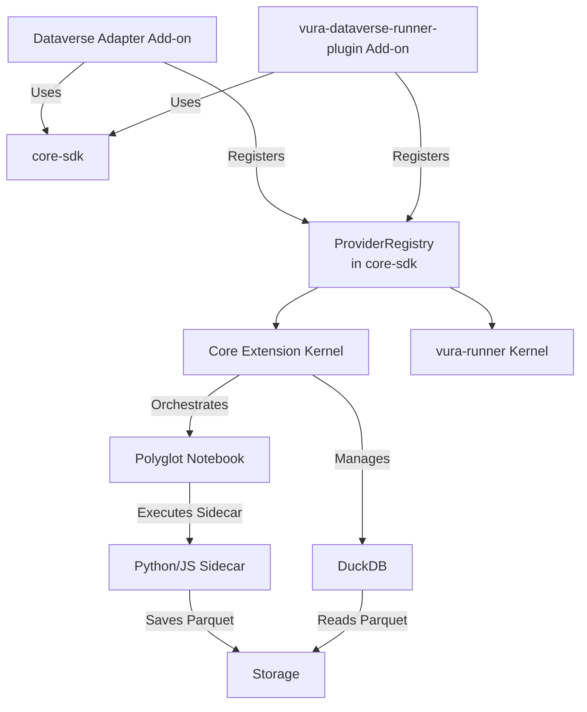

# Architecture & IPC

Welcome to the deep dive on the Vura Data OS Architecture. This document explores the mechanics of our "Bridge" – the DuckDB and Parquet shared-state engine that enables true polyglot execution within VS Code.

## The Polyglot Data-Bridge

The true power of the Vura Data OS is its Inter-Process Communication (IPC) layer. Instead of serializing data as JSON strings and piping it between processes (which is slow and memory-intensive for large datasets), we use a high-performance binary bridge based on **DuckDB** and **Parquet files**.

The core extension acts as the orchestrator. When a notebook cell runs, it spawns an isolated sidecar process (Python or Node.js). This sidecar uses our `vura_bridge` (Vura-Bridge) library to save outputs natively as Parquet files into the workspace storage. When the next cell runs—even in a different language—it queries that same Parquet file using DuckDB.

### The Polyglot Bridge Sequence

This sequence diagram illustrates a common scenario: a SQL cell pulls data and writes it to Parquet, followed immediately by a Python cell reading that same data for analysis.

## Why this architecture?
1. **Zero-Serialization Overhead:** Parquet is a columnar binary format. Reading and writing is exponentially faster than JSON serialization.
2. **True Polyglot State:** Because Parquet is a universal standard, Python (Pandas/Arrow), Node.js (Arrow), and DuckDB can all read the exact same file on disk natively.
3. **Decoupled Execution:** Sidecars run isolated. If a Python script crashes, the Core Extension (and VS Code) remains stable.

## Micro-Kernel Overview

Both kernels — the VS Code Core Extension and the `vura-runner` CLI — are decoupled from external integrations via a Micro-Kernel design, sharing one `ProviderRegistry` (from `core-sdk`) rather than each owning their own.

