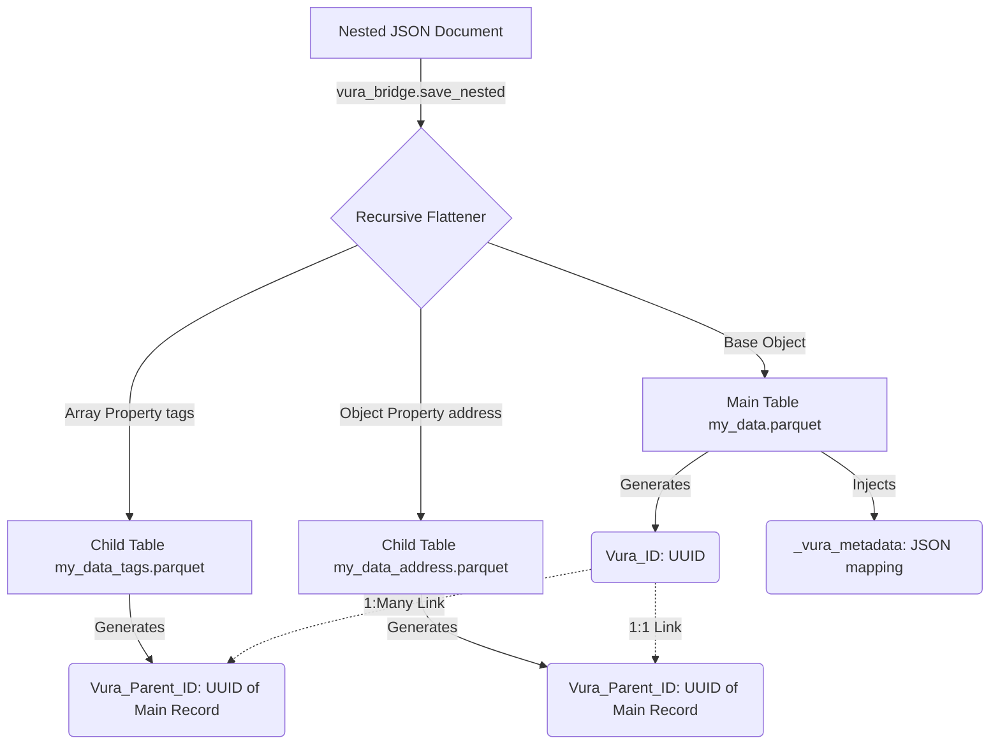

# Data Management & Polyglot Memory Layer

The Vura platform uses **DuckDB** and **Parquet files** to create a zero-copy shared memory layer across multiple languages (Python, JavaScript, SQL).

## The Mob Library (Vura-Bridge)

The `vura_bridge` library is our custom module that handles passing data across process boundaries via Parquet files. Because Parquet is universally supported, Python and Node.js sidecars can run entirely independently, serializing and deserializing outputs directly into the local workspace storage without needing to send massive JSON payloads over stdout/stdin.

## The Auto-Schema Flattener

One of the most powerful features of the `vura_bridge` library (and the `@vura-data-os/core-sdk`) is its ability to automatically flatten deeply nested JSON objects and arrays into relational tables, making them instantly queryable by SQL or Pandas, and then perfectly reconstructing them later.

### The "Shredding" Process

When you invoke the auto-flattener on a nested JSON structure (e.g., pulling data from a complex REST API), the system dynamically "shreds" the hierarchy into relational Parquet tables.

### How it works (Recursive Logic)

When an automated save is invoked:
1.  **Traversal:** It recursively traverses the JSON structure.
2.  **Extraction:** For each nested object or array, it extracts it into its own sub-table.
3.  **Linkage:** It generates a unique `Vura_ID` (GUID) for every base record, and assigns that same GUID as a `Vura_Parent_ID` to all extracted child records to maintain relational linkages.
4.  **Metadata Injection:** It injects a `_vura_metadata` column (as a stringified JSON object) into the base record. This metadata acts as a blueprint, tracking exactly which child tables belong to which keys, and whether they originally were objects or arrays.
5.  **Limits:** It limits traversal via a configurable `vura.depthLimit` setting to avoid infinite recursion or excessively deep table generation.
6.  **Storage:** The sub-tables are saved as separate Parquet files (e.g., `{variableName}_{propertyName}.parquet`).

### Reconstruction

Because the metadata blueprint is saved alongside the relational IDs, reconstructing the object is effortless.

When `vura_bridge.load_reconstructed(variableName)` is called, the system:
1. Reads the main Parquet file.
2. Evaluates the `_vura_metadata` on each record.
3. Fetches the corresponding child Parquet files.
4. Filters the child records by `Vura_Parent_ID` matching the parent's `Vura_ID`.
5. Recursively rebuilds the original complex JSON hierarchy.
