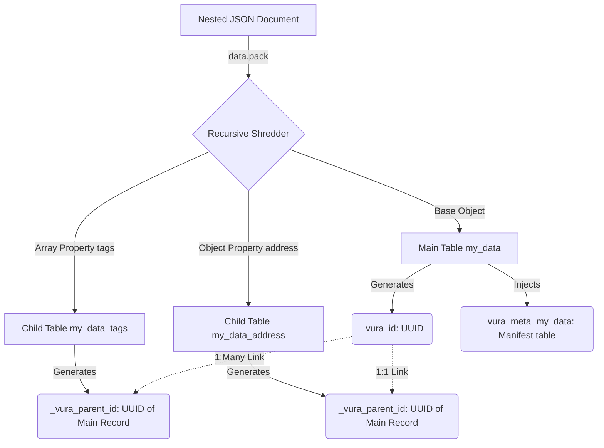

# Data Management & Polyglot Memory Layer

The Vura platform uses **DuckDB** and **Parquet files** to create a zero-copy shared memory layer across multiple languages (Python, JavaScript, SQL).

## The VURA I/O Library (`@vura/io` / `vura.io`)

The `@vura/io` (TypeScript/Node.js) and `vura.io` (Python) libraries handle passing data across process boundaries via DuckDB and Parquet files. Python and Node.js sidecars run entirely independently, serializing and deserializing outputs directly into the local workspace storage without needing to send massive JSON payloads over stdout/stdin.

## The Relational DuckDB JSON Shredder

One of the most powerful features of the VURA I/O library is its ability to automatically shred deeply nested JSON objects and arrays into relational DuckDB tables, making them instantly queryable by SQL or Pandas, and then perfectly reconstructing them later via `data.unpack()`.

### The "Shredding" Process (`data.pack`)

When you invoke `data.pack(name, obj)` on a nested JSON structure (e.g., pulling data from a complex REST API), the system dynamically shreds the hierarchy into relational DuckDB tables linked by `_vura_parent_id`.

```mermaid
graph TD
    A[Nested JSON Document] -->|data.pack| B{Recursive Shredder}

    B -->|Base Object| C[Main Table my_data]
    B -->|Array Property tags| D[Child Table my_data_tags]
    B -->|Object Property address| E[Child Table my_data_address]

    C -->|Generates| C1(_vura_id: UUID)
    C -->|Injects| C2(__vura_meta_my_data: Manifest table)

    D -->|Generates| D1(_vura_parent_id: UUID of Main Record)
    E -->|Generates| E1(_vura_parent_id: UUID of Main Record)

    C1 -.->|1:Many Link| D1
    C1 -.->|1:1 Link| E1
```

### Reconstruction (`data.unpack`)

Because the manifest metadata is saved alongside the relational IDs, reconstructing the object is effortless.

When `data.unpack(name)` is called, the system:
1. Reads the `__vura_meta_<name>` manifest table.
2. Evaluates table hierarchy, array ordering (`_vura_index`), and structural field types.
3. Fetches the corresponding DuckDB tables.
4. Performs topological joins from leaf tables back to root tables matching `_vura_parent_id`.
5. Reconstitutes the original complex JSON hierarchy with 100% structural parity.
