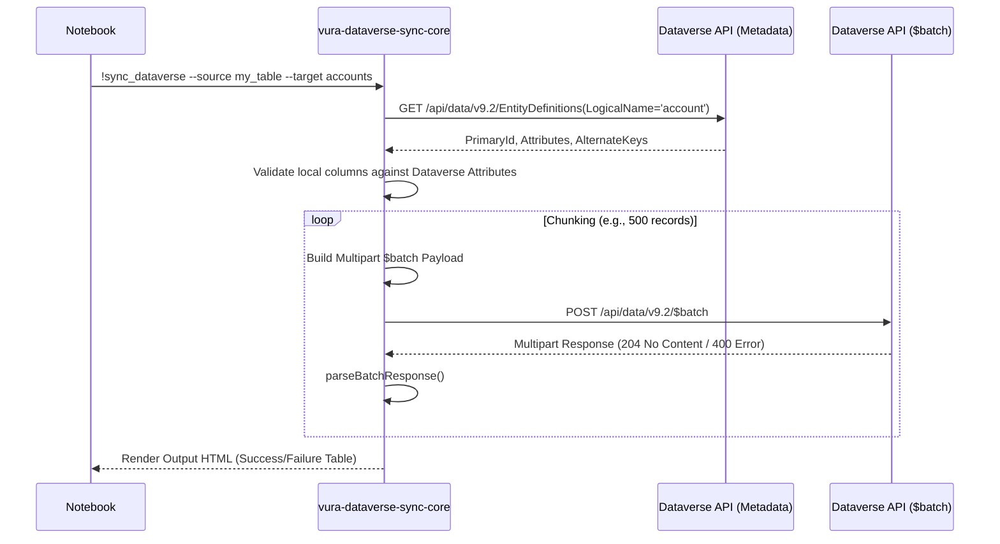

# Dynamics 365 Integration

This document details how VURA writes data *back* into Dynamics 365 (Dataverse).

While SQL is used for querying (via TDS endpoint), Dataverse is strictly read-only through TDS. To solve this, the integration uses the Dataverse Web API (OData V4) to perform inserts, updates, and deletes seamlessly.

The integration is split across three packages so the same sync logic runs in either kernel:

- **`packages/vura-dataverse-sync-core`** — the actual `$batch` sync engine: argument parsing, Dataverse metadata lookup, batch chunking/sending, response parsing, HTML result rendering. Depends only on `@vura-data-os/core-sdk`'s host-agnostic types (`FlownbCell`, `ICellLogger`, `IVuraEnvironment`) — no `vscode` import at all.
- **`packages/vura-dataverse-adapter`** — the VS Code Add-on: a thin `IVuraProvider` wrapper that registers with `core-extension` and delegates `!sync_dataverse` to `vura-dataverse-sync-core`.
- **`packages/vura-dataverse-runner-plugin`** — the `vura-runner` CLI plugin: the same wrapper, registering with the CLI's `ProviderRegistry` instead. See [SDK Guide](sdk_guide.md#vura-runner-cli) for how a notebook declares it via `requiredPlugins`, or how to set it globally via `vura.plugins`.

---

## The $batch Synchronization Engine

The primary engine for pushing data to Dataverse is triggered by the `!sync_dataverse` command in a `vura-terminal` cell, or via the `-- !odata-push` magic comment in a SQL cell.

It automatically handles OData V4 formatting, authentication, and chunked `$batch` processing to abide by API limits, while dynamically validating local tables against live Dataverse metadata to prevent schema errors.

`!sync_dataverse` only reaches this engine if a provider for it is registered — in VS Code, `vura-dataverse-adapter` must be installed and active; in the CLI, `vura-dataverse-runner-plugin` must be loaded (via `requiredPlugins` or `vura.plugins`). Otherwise the command falls through to a raw shell command and fails with "command not found".

### The Sync Process Flow

This sequence diagram explains how data moves from the DuckDB local storage, through validation, and into the Dataverse OData endpoint via multipart Batch requests.

> **Pro-Tip for Handling Errors:**
> Due to the high volume of records involved in `$batch` operations, partial failures can occur. We strictly **do not** use OS/editor-level notification popups for these data errors. Instead, `vura-dataverse-sync-core` renders an HTML table detailing exactly which UUIDs failed and why, directly in the Notebook Cell Output (via `ICellLogger.replaceOutput`) — identically in VS Code and the CLI.

---

## Local Development

Making thousands of experimental write calls against a live CRM tenant is risky and slow. To develop against the adapter without a live Dynamics 365 tenant, point it at any local or sandbox endpoint that implements the OData v4 `$batch` protocol:

1. **Configure the Connection:**
   - **VS Code:** use the command palette (`Ctrl+Shift+P` -> `VURA Notebook: Set Connection`) to point the active cell's `cell.metadata.connectionId` at your OData v4 endpoint (e.g. `http://localhost:8080/api/data/v9.2/`).
   - **CLI:** `vura-runner credentials add <id> <server> <database> ServicePrincipal --client-id ... --tenant-id ...`, then reference `<id>` as `dataverseConnectionId` in the cell's metadata.
2. The sync engine will seamlessly route queries and `$batch` operations to that endpoint, in either host.

A ready-made local mock server that simulates the full Dynamics 365 OData `$batch` API — so you can develop against realistic CRM data without any external dependency — ships as part of VURA Enterprise.
