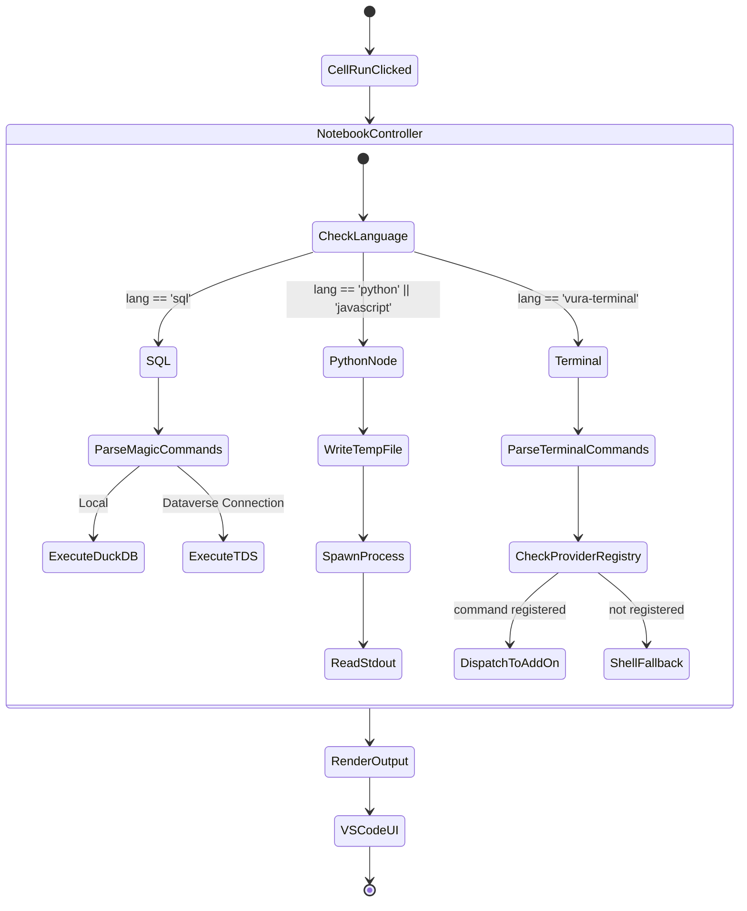

# Notebook Provider & Cell Execution

This document explains the mechanics of the custom VS Code Notebook provided by this extension. It covers how notebook files (`.flownb` / `.sqlnb`) are stored, how the Extension Host renders them, and how individual cells are executed.

---

## 1. Feature Overview

### What it does
The extension registers a custom notebook type (`vura-notebook`) with VS Code. It provides its own serializer to read/write the notebook files and its own controller to manage execution for four distinct language types: `sql`, `python`, `javascript` (Node.js), and `vura-terminal`.

### User Impact
Users interact with a native VS Code notebook interface. They can switch languages per cell, view native outputs (like data grids or JSON), and utilize cell-specific metadata (like assigning a specific variable name to the output of a SQL cell).

---

## 2. Deep Dive: The Code

### The Notebook Serializer (`notebookSerializer.ts`)

**Entry Point:** `src/notebookSerializer.ts`

VS Code requires a `NotebookSerializer` to convert raw byte data from disk into `vscode.NotebookData` (and vice-versa).

#### Logic Flow:
1. **Deserialization:** When a `.flownb` file is opened, VS Code reads the file bytes and passes them to `deserializeNotebook`, which uses `vura-runner`'s shared `parseFlownbDocument` to decode the YAML — the same parser the CLI uses, so both hosts agree on the format (including the legacy bare-array form and the versioned `{ version, cells, requiredPlugins }` form).
2. **Serialization:** When the user saves, `serializeNotebook` converts the in-memory cell data (Language, Kind, Value, Metadata) into `FlownbCell[]` and passes it to the same `serializeFlownbDocument`. A notebook's `requiredPlugins` (declared Add-on plugins for the CLI) round-trips via `NotebookData.metadata`.

> **Pro-Tip:** Notebook cell *outputs* (the actual data results) are intentionally excluded from serialization. This keeps the notebook files lightweight and suitable for source control.

#### Code Snippet: Serializing Cells
```typescript
const cells: FlownbCell[] = data.cells.map(cell => ({
    kind: cell.kind === vscode.NotebookCellKind.Code ? 2 : 1,
    language: cell.languageId,
    value: cell.value,
    metadata: cell.metadata
}));

const requiredPlugins = data.metadata?.requiredPlugins as string[] | undefined;
return new TextEncoder().encode(serializeFlownbDocument(cells, requiredPlugins));
```

---

### The Notebook Controller (`notebookController.ts`)

**Entry Point:** `src/notebookController.ts`

The Controller is responsible for actually running the code within the cells.

#### Logic Flow:
1. **Trigger:** The user clicks "Run Cell" or "Run All".
2. **Execution Task:** VS Code creates a `NotebookCellExecution` task.
3. **Routing:** The controller inspects `cell.document.languageId` and routes the execution:
   - **`sql`**: Handled via `_executeSql()`. Parses magic commands (`-- !ingest-file`) or runs the query against Dataverse or local DuckDB.
   - **`python` / `javascript`**: Handled via `_executeScript()`. Writes a temp file and spawns the appropriate sidecar.
   - **`vura-terminal`**: Handled via `_executeTerminal()`. For each `!` line, checks the shared `ProviderRegistry` (from `core-sdk`) for a registered Add-on handling that command (e.g. `!sync_dataverse`) and dispatches to its `handleCommand()`; anything unrecognized falls back to a raw shell command.
4. **Output Rendering:** Upon completion, the controller formats the results (e.g., generating HTML grids) and appends them to the execution task using `vscode.NotebookCellOutputItem`.

#### Technical Breakdown:

| Method | Parameters | Return Type | Purpose |
|--------|------------|-------------|---------|
| `_executeSql` | `cell: vscode.NotebookCell`, `execution: vscode.NotebookCellExecution` | `Promise<void>` | Runs SQL queries, handles OData/Ingestion magic commands, and outputs an HTML table. |
| `_executeScript` | `cell`, `execution`, `lang: 'python'\|'node'` | `Promise<void>` | Spawns sidecars for isolated execution, capturing stdout for `vura_bridge` events or graph rendering. |
| `_getGridHtml` | `data: any[]` | `string` | Generates the HTML string containing the AG-Grid/native HTML table for data visualization. |

---

## 3. Visual Context

### Cell Execution Lifecycle

This diagram illustrates the lifecycle of a single cell execution, highlighting the routing based on language type.

