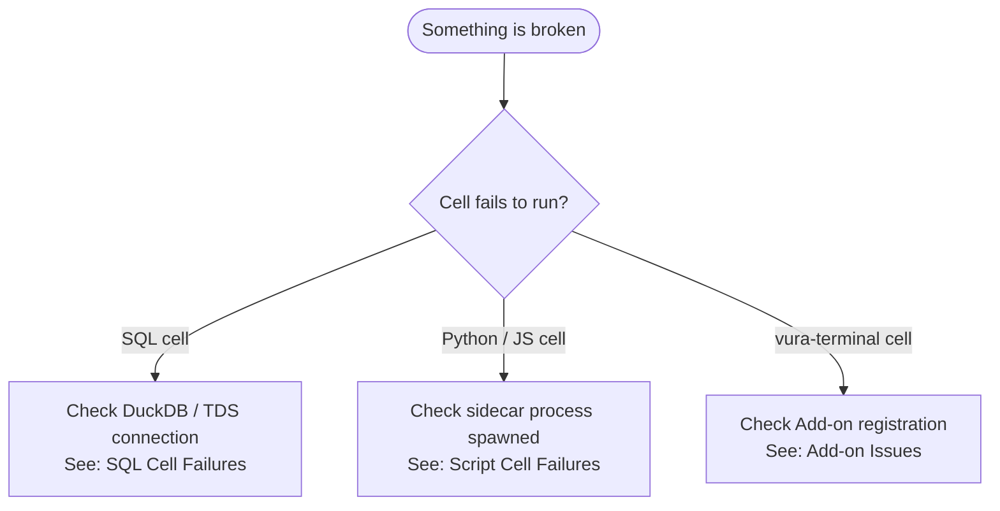
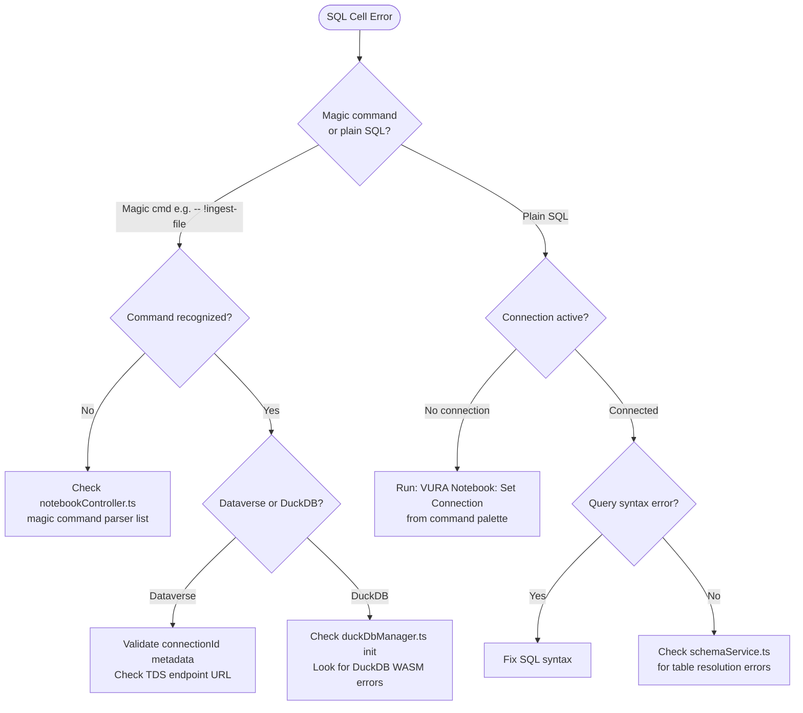
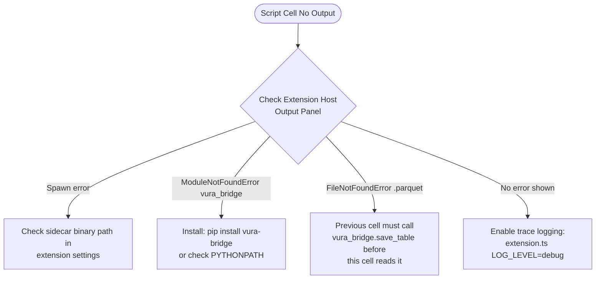

# Troubleshooting Guide

This guide covers common failure modes in the VS Code extension and the local DuckDB/Parquet bridge.

---

## Diagnosis Decision Tree

Start here when something is broken. Follow the arrows.



---

## VS Code Extension Issues

### SQL Cell Failures

**Symptom:** SQL cell shows error or hangs.



**Diagnostic commands:**
```bash
# Check VS Code extension host logs
code --log trace

# Verify DuckDB WASM loaded (Browser DevTools Console in VS Code WebView)
# Look for: "DuckDB initialized" in Extension Host output
```

---

### Script Cell Failures (Python / JavaScript)

**Symptom:** Python or JS cell produces no output or fails silently.

Common causes:
1. **Sidecar not running** — The extension spawns a child process. If it crashes, cells hang.
2. **Missing `vura_bridge`** — The library isn't installed in the sidecar's Python/Node environment.
3. **Parquet file not found** — A cell references a variable from a previous cell that wasn't saved.



---

### Add-on Registration Issues

**Symptom:** `!sync_dataverse` or custom magic commands are not recognized — they run as a raw shell command and fail with "command not found" (or worse, silently execute as an unintended shell command if the syntax happens to contain shell metacharacters like `>`).

That symptom means `ProviderRegistry.getProviderForCommand()` found no match — the Add-on was never registered, in whichever host you're using:

```mermaid
flowchart TD
    S([Command Not Recognized]) --> H{VS Code or CLI?}

    H -->|VS Code| Q1{Add-on extension\ninstalled?}
    Q1 -->|No| A1[Install the Add-on extension\ne.g. vura-dataverse-adapter]
    Q1 -->|Yes| Q2{Core extension active?}
    Q2 -->|No| A2[Reload VS Code window\nCtrl+Shift+P → Reload Window]
    Q2 -->|Yes| Q3{getCommands returns\nthe command?}
    Q3 -->|No| A3[Fix getCommands in\nAdd-on IVuraProvider impl]
    Q3 -->|Yes| A4[Check registerProvider call\nin Add-on activate function\nSee sdk_guide.md]

    H -->|CLI| Q4{Plugin package\ninstalled?}
    Q4 -->|No| A5["npm install -g the-plugin-package"]
    Q4 -->|Yes| Q5{Declared in\nrequiredPlugins or\nvura.plugins config?}
    Q5 -->|No| A6["Add to notebook's requiredPlugins,\nor: vura-runner config set vura.plugins\n'[\"the-plugin-package\"]'"]
    Q5 -->|Yes| A7[Check for a "Warning: failed to\nload plugin" line in cell output —\nthe package's default export must\nimplement IVuraProvider]
```

---

## Performance Considerations

### Parquet IPC vs JSON

The zero-copy Parquet IPC approach is orders of magnitude faster than JSON over stdout for large datasets, but there are edge cases:

| Dataset size | Recommended approach | Notes |
|---|---|---|
| < 1,000 rows | Either | JSON stdout is fine |
| 1,000–100,000 rows | `vura_bridge.save_table` | Parquet advantage kicks in |
| > 100,000 rows | `vura_bridge.save_nested` + DuckDB | Use DuckDB streaming queries |

### DuckDB Query Performance

```python
# Inefficient: loads entire Parquet into memory
df = vura_bridge.get_table("large_dataset")
result = df[df['status'] == 'active']

# Efficient: pushes predicate down to DuckDB scan
import duckdb
result = duckdb.query(
    "SELECT * FROM read_parquet('/mnt/vura-shared/runId/large_dataset.parquet') WHERE status = 'active'"
).df()
```

---

## Getting More Help

- **Extension Host logs:** VS Code → View → Output → Select "Vura Data OS"

Running the full distributed stack (Control Plane, Orchestrator, Kafka)? See the VURA Enterprise troubleshooting guide instead — this doc only covers the local extension.
